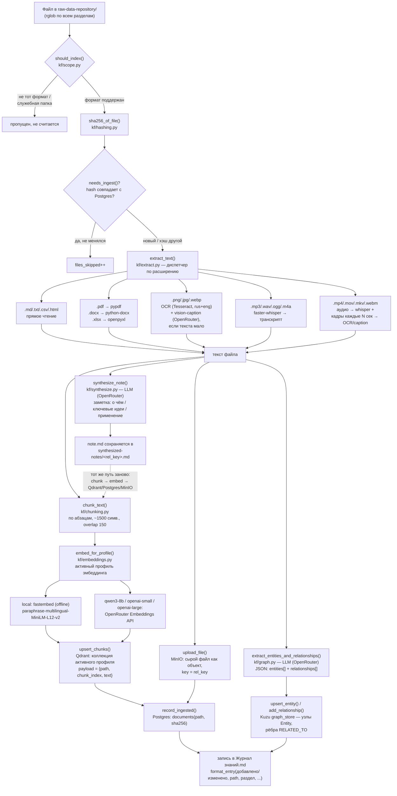

# Pipeline индексации: от файла до вектора

Как `kf.py ingest` превращает файл в `raw-data-repository/` в набор строк в Postgres,
точек в Qdrant, объектов в MinIO и узлов/рёбер в графе Kuzu. Один проход по каждому
файлу — это цепочка чистых функций, без скрытого состояния между шагами; управляет
всем `ingest_directory()` в `knowledge-factory/kf/ingest.py`.

## Схема

## Пошаговый алгоритм (`ingest_directory`, `kf/ingest.py`)

1. **Обход дерева.** `sorted(source_dir.rglob("*"))` — все файлы `raw-data-repository/`
   рекурсивно, в детерминированном порядке (важно для воспроизводимости журнала).

2. **Фильтр области сканирования — `should_index()` (`kf/scope.py`).**
   Отбрасывает служебные папки (`.git`, `node_modules`, `.venv`, `__pycache__` и т.п.),
   файлы из явного чёрного списка (`EXCLUDED_FILENAMES`) и любое расширение вне
   `INCLUDED_EXTENSIONS` (сейчас: `.md .txt .pdf .docx .csv .html .png .jpg .jpeg .webp
   .mp4 .mov .mkv .webm .mp3 .wav .ogg .m4a .xlsx`).

3. **Ключ файла.** `rel_key = path.relative_to(source_dir).as_posix()` — путь относительно
   корня vault, всегда с префиксом раздела (`003 Знания/...`). Это первичный ключ везде:
   в Postgres, в payload точек Qdrant, в объектах MinIO, в графе.

4. **Дедупликация по контенту — `sha256_of_file()` + `needs_ingest()`.**
   Хэш всего файла побайтово (`kf/hashing.py`) сравнивается с последним сохранённым
   в Postgres (`documents.sha256`). Если совпал — файл пропускается (`files_skipped++`),
   никакие LLM/OCR/embedding-вызовы не тратятся. Если файла ещё не было — `is_new = True`
   (влияет только на текст записи в журнале: «добавлено» vs «изменено»).

5. **Извлечение текста — `extract_text()` (`kf/extract.py`), диспетчер по расширению:**
   - Текстовые (`.md/.txt/.csv/.html`) — прямое чтение UTF-8.
   - `.pdf` — `pypdf`, постранично.
   - `.docx` — `python-docx`, по абзацам.
   - `.xlsx` — `openpyxl`, построчно по всем листам, ячейки через `|`.
   - Изображения (`.png/.jpg/.jpeg/.webp`) — локальный OCR (Tesseract, `rus+eng`);
     если распознанного текста меньше `IMAGE_CAPTION_THRESHOLD_CHARS` (по умолчанию 20
     символов), дополнительно вызывается vision-модель через OpenRouter
     (`google/gemini-2.5-flash`) для текстового описания картинки.
   - Аудио (`.mp3/.wav/.ogg/.m4a`) — `faster-whisper` (модель `small`, автоопределение
     языка), локально, без облака.
   - Видео (`.mp4/.mov/.mkv/.webm`) — звук извлекается и идёт тем же путём, что аудио;
     параллельно кадры сэмплируются каждые `VIDEO_FRAME_INTERVAL_SECONDS` (по умолчанию
     15 сек, максимум `MAX_VIDEO_FRAMES` = 20 кадров на файл — защита от неконтролируемых
     трат на vision-API) и каждый кадр проходит тот же путь, что обычное изображение.
   - Ошибка на любом шаге здесь — файл помечается `files_failed++` и пропускается,
     остальные файлы батча не страдают (ошибка ловится на уровне одного файла).

6. **Чанкинг — `chunk_text()` (`kf/chunking.py`).**
   Текст режется по абзацам (`\n\s*\n`), абзацы жадно склеиваются в чанки до
   `max_chars` (по умолчанию 1500 символов); слишком длинный одиночный абзац режется
   окном `max_chars`/`overlap` (по умолчанию 150 символов внахлёст, чтобы не рвать мысль
   ровно на границе).

7. **Эмбеддинг — `embed_for_profile()` (`kf/embeddings.py`), по активному профилю
   (`kf/embedding_models.py`, `kf/embedding_state.py`):**
   - `local` (по умолчанию) — `fastembed`, модель
     `paraphrase-multilingual-MiniLM-L12-v2`, 384 измерения, полностью офлайн.
   - `qwen3-8b` / `openai-small` / `openai-large` — запрос к OpenRouter Embeddings API
     (`embed_via_openrouter`), 4096 / 1536 / 3072 измерения соответственно.
   - У каждого профиля — своя коллекция Qdrant (`knowledge`, `knowledge__qwen3_8b`,
     `knowledge__openai_small`, `knowledge__openai_large`), поэтому переключение профиля
     не требует пересчёта размерности существующих векторов.

8. **Запись в хранилища — четыре параллельные записи, без общей транзакции
   (согласованность — best-effort, не строгая):**
   - **Qdrant** (`upsert_chunks`) — один `PointStruct` на чанк, `id = point_id(rel_key,
     chunk_index)` (детерминированный UUID5 от пути+индекса — повторный `ingest` того же
     чанка переписывает точку, а не плодит дубли), `payload = {path, chunk_index, text}`,
     метрика — косинусная (`Distance.COSINE`).
   - **MinIO** (`upload_file`) — сырой файл целиком как объект, `object_name = rel_key`
     (не чанки — оригинал целиком, для возможности скачать/восстановить).
   - **Postgres** (`record_ingested`) — одна строка в `documents(path, sha256)`, источник
     истины для дедупликации и для `sync-deletions`.
   - Порядок в коде: Qdrant → MinIO → Postgres (запись в Postgres — последней, уже после
     того как контент реально лёг в векторное и объектное хранилище).

9. **Синтез заметки — `synthesize_note()` (`kf/synthesize.py`), только для не-заметок
   (файл не из `synthesized-notes/`, иначе была бы бесконечная рекурсия заметок).**
   Один вызов LLM через OpenRouter (модель — `settings.llm_model`), фиксированный промпт
   на русском: о чём материал / ключевые идеи / как пригодится. Результат сохраняется как
   `synthesized-notes/<rel_key>.md` **и сам проходит шаги 3–8 заново** — заметка тоже
   чанкуется, эмбеддится и индексируется отдельным документом со своим `rel_key`
   (`synthesized-notes/<исходный путь>.md`), так что семантический поиск находит и сырой
   материал, и его выжимку. Сбой синтеза (например, недоступен OpenRouter) не прерывает
   индексацию исходного файла — только пропускает создание заметки (`notes_failed++`).

10. **Извлечение сущностей и связей — `extract_entities_and_relationships()`
    (`kf/graph.py`), тоже LLM-вызов через OpenRouter, отдельный от синтеза заметки.**
    Промпт просит строго JSON: список сущностей (`name`, `type`) и связей (`from`, `to`,
    `category` — одна из 5 фиксированных категорий, `description`). Перед записью старые
    связи с этим `rel_key` удаляются (`delete_relationships_by_source`) — переиндексация
    изменённого файла не оставляет висящих устаревших рёбер. Сбой парсинга JSON или сети —
    не прерывает остальной ingest (`entities_failed++`).

11. **Журнал — `format_entry()` / `append_entries()` (`kf/journal.py`).**
    На каждый обработанный файл — одна строка в `Журнал знаний.md` (раздел, действие
    «добавлено»/«изменено», краткое описание из первого абзаца синтезированной заметки).
    После прохода по всем файлам, если `detect_deletions=True` (обычный `kf.py ingest`,
    но не `ingest-url`, где сканируется весь vault и это дало бы ложные срабатывания на
    файлах, до которых просто не дошла очередь в этом вызове) — сравнивается список путей
    в Postgres со списком реально увиденных файлов; расхождение пишется в журнал как
    «удалено», но **не приводит к автоматической очистке хранилищ** — это отдельный
    осознанный шаг, см. ниже.

## Обратный путь: удаление (`kf.py sync-deletions`)

Не часть обычного `ingest`, отдельная команда (`kf/deletion_sync.py`) — по дизайну:
удаление контента должно быть explicit-действием, не побочным эффектом обхода файлов.

1. `compute_deletion_candidates()` сравнивает пути, известные Postgres, с путями, реально
   увиденными при последнем скане. Каждый пропавший путь классифицируется по хэшу: если
   его последний известный хэш совпадает с хэшем какого-то **другого** пути, который
   сейчас существует — это «похоже на переименование» (не трогаем); иначе — «подтверждено
   удалён».
2. Без флагов — команда только показывает план (dry-run).
3. С `--yes` — по каждому подтверждённо удалённому пути `purge_source()` чистит: исходный
   файл и его синтезированную заметку — из Postgres, из **всех** Qdrant-коллекций по всем
   4 профилям эмбеддинга (с проверкой `collection_exists()`, чтобы не шуметь ошибками для
   ни разу не использованных профилей), из MinIO, из графа (`delete_relationships_by_source`)
   и с диска (файл заметки). Каждое из пяти хранилищ чистится независимо, в своём
   `try/except` — частичный сбой одного не блокирует остальные, но печатается предупреждение.

## Ключевые файлы

| Файл | Роль |
|---|---|
| `kf/ingest.py` | оркестратор всего пайплайна, `ingest_directory()` |
| `kf/scope.py` | что вообще попадает в индексацию |
| `kf/hashing.py` | sha256 для дедупликации |
| `kf/extract.py` | текст из любого формата файла |
| `kf/chunking.py` | нарезка текста на чанки |
| `kf/embeddings.py`, `kf/embedding_models.py`, `kf/embedding_state.py` | эмбеддинг + переключаемые профили |
| `kf/store/qdrant_store.py`, `postgres.py`, `minio_store.py`, `graph_store.py` | клиенты четырёх хранилищ |
| `kf/synthesize.py` | LLM-заметка по материалу |
| `kf/graph.py` | LLM-извлечение сущностей/связей |
| `kf/journal.py` | запись в `Журнал знаний.md` |
| `kf/deletion_sync.py` | обратный путь — контролируемая очистка при реальном удалении файла |
| `kf/web_extract.py` | предварительный шаг для `ingest-url` — скачивает контент по ссылке до того, как он войдёт в этот же pipeline как обычный файл |
